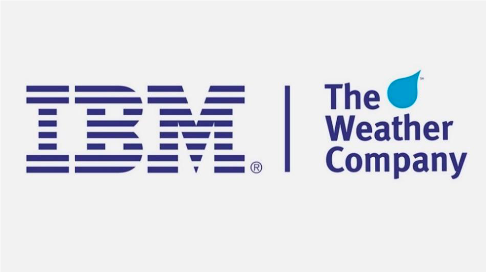
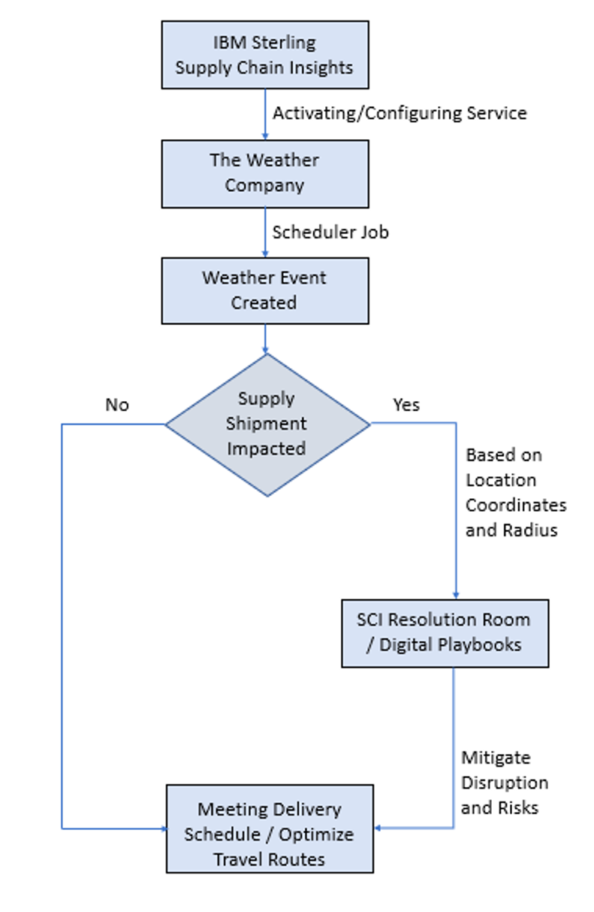

# IBM Sterling Supply Chain Insights and <i>The Weather Company</i> Service

Today, every business is different, but in many ways businesses that exist within various industries are impacted differently by weather. Weather conditions are getting more unpredictable and it impacts almost every sector like energy generation, agriculture, transportation, insurance, aviation and many more industries. Managing global supply chains under these conditions can be a both tricky and risky business. Extreme weather, epidemics and other unexpected events can disrupt the delivery of products and services, which may impact your upcoming delivery schedules and bring your assembly lines to a halt due to lack of raw materials. Businesses lack control of these unpredictable supply chain scenarios.

IBM Sterling Supply Chain Insights with Watson can help businesses to turn these disruptions into opportunities for growth and profit. It provides visibility across your supply chain to help you manage constant change. It helps to quickly detect potential disruptions and collaborate with colleagues and IBM Watson to resolve issues. Supply Chain managers can synthesize insights by combining location-specific data from social media and The Weather Company to help predict and mitigate the impact of unexpected events.

Weather services are available in IBM Sterling Supply Chain Insights with Watson through The Weather Company. The Weather Company brings accurate, timely, high-resolution weather forecasts to all businesses. The terabytes of information available in a weather forecast need to be refined to the essential components that impact your business. You can now integrate weather data into your operations for better business outcomes. The Weather Company delivers personalized, actionable insights to consumers and businesses across the globe by combining the world’s most accurate weather data with industry-leading AI, Internet of Things (IoT) and analytics technologies. For example, use weather services to improve on-time deliveries and optimize travel routes by predicting potential disruptions in operations due to weather events.

&ensp;

<html>
<head>
<meta name="viewport" content="width=device-width, initial-scale=1">
</head>
<body>

</body>
</html>

&ensp;

## How does it work in IBM Sterling Supply Chain Insights

<ol>
<li>Administrator configures and activates the OOTB Weather Company connector service within Supply Chain Insights. The user can select the countries to show weather alerts that might impact their supply chain.</li>
<li>Once the service is activated, a scheduler job runs into backend and gets all the weather alerts from ‘The Weather Company’ and convert these alerts into External Events that the Supply Chain Insights understands and load it to the application.</li>
<li>Based on the weather alerts, external events will be created for the impacted location having coordinates (Longitude, Latitude) and the impacted radius. If your shipments based on its location falls within the external event radius, then the shipment will get impacted due to this external event.</li>
<li>Supply Chain Managers can quickly collaborate with Watson and other team members using Resolution Room and ensure that appropriate action is taken to improve on-time deliveries, optimize the travel routes or check for an alternative supply source to avoid disruptions.</li>
</ol>

&ensp;

<html>
<head>
<meta name="viewport" content="width=device-width, initial-scale=1">
</head>
<body>

</body>
</html>

&ensp;

If your supply chain has been struggling with unexpected weather, you now have options as to handle the situation.  Instead, let’s turn these disruptions into opportunities for our customers. The Weather Company data will help businesses in any industry to avoid business delays resulting in customer satisfaction and revenue growth.

## Use Case Example

In preparation to respond to a weather event, Supply Chain Managers can redirect resources and proactively provide alerts to customers and drivers in areas impacted by severe weather. A weather company API provides current and forecast conditions of weather and helps in creating weather events with the expected start date, estimated end date, event severity, location coordinates and impact radius of the event.
For example, a shipment is moving from its origin location (i.e. Mumbai) towards its destination location (i.e. Chennai) and its current location is around Ratnagiri. The Weather Company service creates an external event for the location ‘Goa’ experiencing the impact (radius of 20 Kms). With the provided scenario, our shipment will not be impacted due to this external event. However, our shipment might get delayed due to the timeframe of this external event. In this scenario, you may opt for an alternative route or extend your route to avoid this disruption and ensure on time delivery of your shipment. Weather services helps to improve on-time deliveries and optimize travel routes by predicting potential disruptions in operations due to weather events.

## Additional References

* [The Weather Company Data Services](https://www.ibm.com/support/knowledgecenter/SSJGEG/sci_q_a_watson_assistant/q_weather.html)
